# Recording Setup

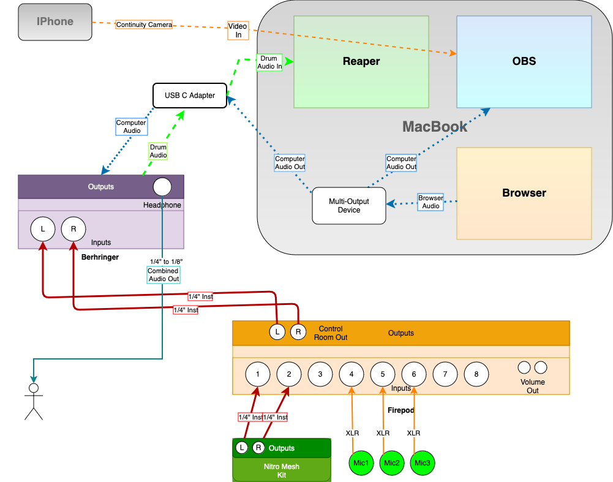

## Introduction

This entire setup is based on it’s good enough; I don’t hate the end result, it’s painless enough to use regularly, and it’s cheap enough. Multi-track audio and video would be nice but you can’t always get what you want, especially for mostly free and easy.

As I type this up I’m realizing there was quite a bit of setup, but most of it only has to happen once. It’s really not burdensome to use on a week-to-week basis. I swear.

<h3>
Physical Setup</h3>

Things I have: Drums, Alesis Nitro Mesh ekit, three microphones, tripod with phone holder. Firepod interface, Behringer interface, laptop with USB-C adaptor.

The two condenser mics are set in recorderman setup[^1]. Spaced overhead, XY or Glyn Johns would probably give good results too, a little experimentation might be helpful because mic placement is half the battle[^2]. And then a dynamic mic in the kick drum. Because, yeah, it’s hard to get a solid kick sound without a close mic.

The drum mics and Alesis are plugged into the Firepod interface. Alas, the Firepod suffered from a power spike so it doesn’t digitize multi-track. _It is essentially summing all my inputs into an analog stereo output_[^3]_. Plugging 2 mics straight into the Behringer interface is the same thing, in principle._

So, on the Firepod I set the ratios between my mics with their individual input gains and I use the Master volume to control how much signal (the stereo output) is sent to the Behringer interface. The Firepod control room outputs feed into the Behringer. I use the Behringer inputs to balance the incoming L/R signal. Why are they different? I don’t know, doesn’t really matter.

My headphones are plugged into the Behringer headphone output so I have a separate volume control for my IEMs.

The drum audio is digitized by the Behringer and sent to the computer through the USB connection.

Reaper records the incoming drum audio (see below).

<h3>
Logical Setup</h3>

Inside the computer you need to be able to send browser/computer audio to two places: OBS and the interface. For reasons that are unclear to me, this is way harder than it should be.

<h5>
Macbook:</h5>

Install BlackHole (I use 2-channel): [https://github.com/ExistentialAudio/BlackHole](ttps://github.com/ExistentialAudio/BlackHole/wiki/Multi-Output-Device)

Follow these instructions to setup Multi-Output: [https://github.com/ExistentialAudio/BlackHole/wiki/Multi-Output-Device](https://github.com/ExistentialAudio/BlackHole/wiki/Multi-Output-Device)

My laptop remembers this setting most of the time, but occasionally I have to go back into _Audio Midi Setup_ and reselect the interface (USB Audio CODEC).

\*Every time I go to play, I plug in my Behringer and in the taskbar, go to Control Center 
/Sound and select Multi-Output. This sends the audio out the interface instead of the laptop speakers. When I’m done, I switch it back to External Speakers.

<h5>
Windows:</h5>

It just works? I don’t remember doing anything special to set it up. If I did, I have blocked out the memory. But when I plug in the Behringer, computer audio goes out to it, and to OBS.

<h3>OBS Recording Setup</h3>

It is possible to record all the audio in OBS but you get whatever is coming straight off the interface and you better have your computer audio and drum levels exactly how you want them relative to each other and hope they don’t change. I mean, you can record the inputs to separate tracks and go in and fix them later in a video editor if you had to[^4] but that’s the same amount of work. But you _can_ add an Audio Input Device, assign it to different tracks, and point it at the USB Audio CODEC input. I take no responsibility for the troubles that arise. Or it might work perfectly, I don’t know[^5]. No one can understand this stuff.

Carrying on with the overly detailed explanation of my setup:

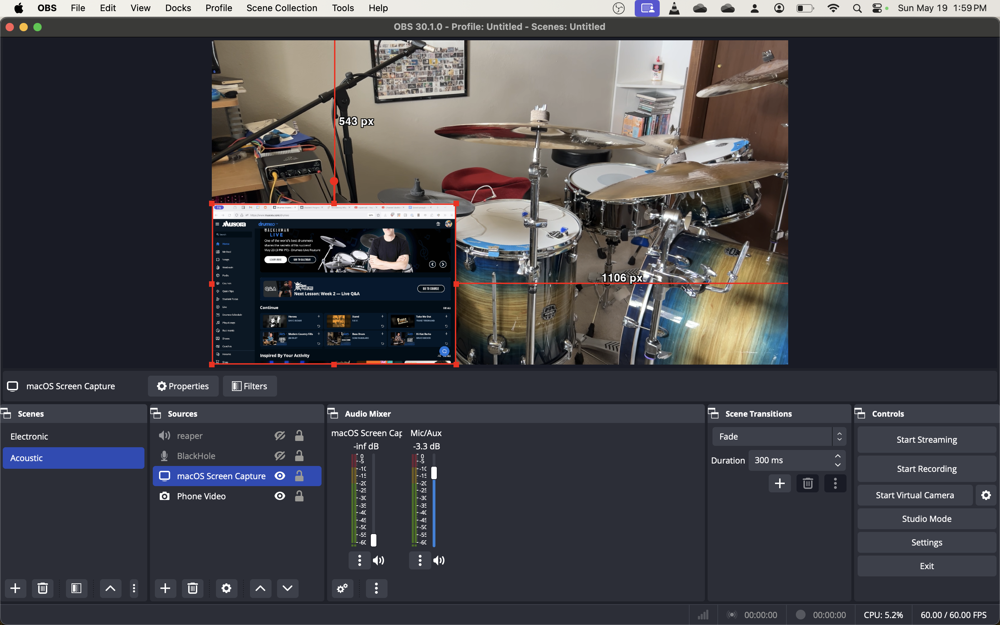

<h4>Audio</h4>

- In the Mic/Aux Properties, assign it to BlackHole. This is the Computer audio. I run mine at -3.1db.

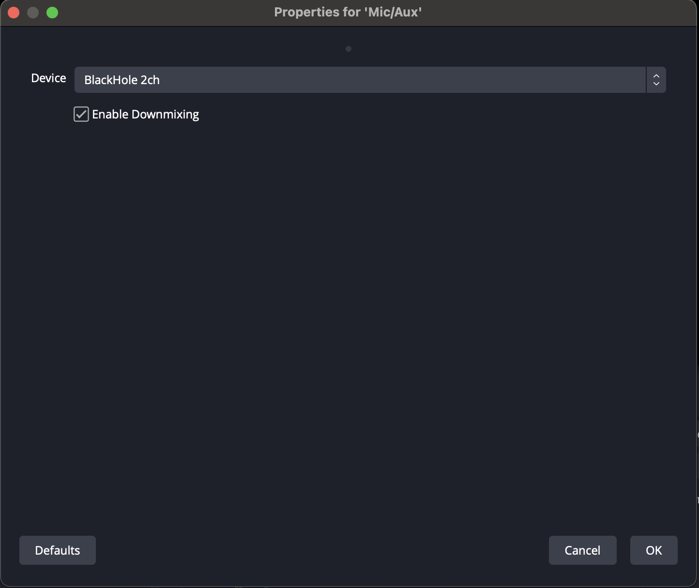

- Make sure Audio Monitoring is off in Advanced Audio Properties.

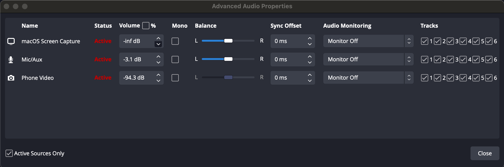

<h4>Video</h4>

- Add a Video Capture Device. Select the phone as the Device. I use the MacOS built-in Continuity Camera now, I have no idea how the phone and laptop talk to each other, they just work it out amongst themselves and when I open OBS, my phone turns on. Previously, I used EpoCam with ~~no~~ very few issues.

  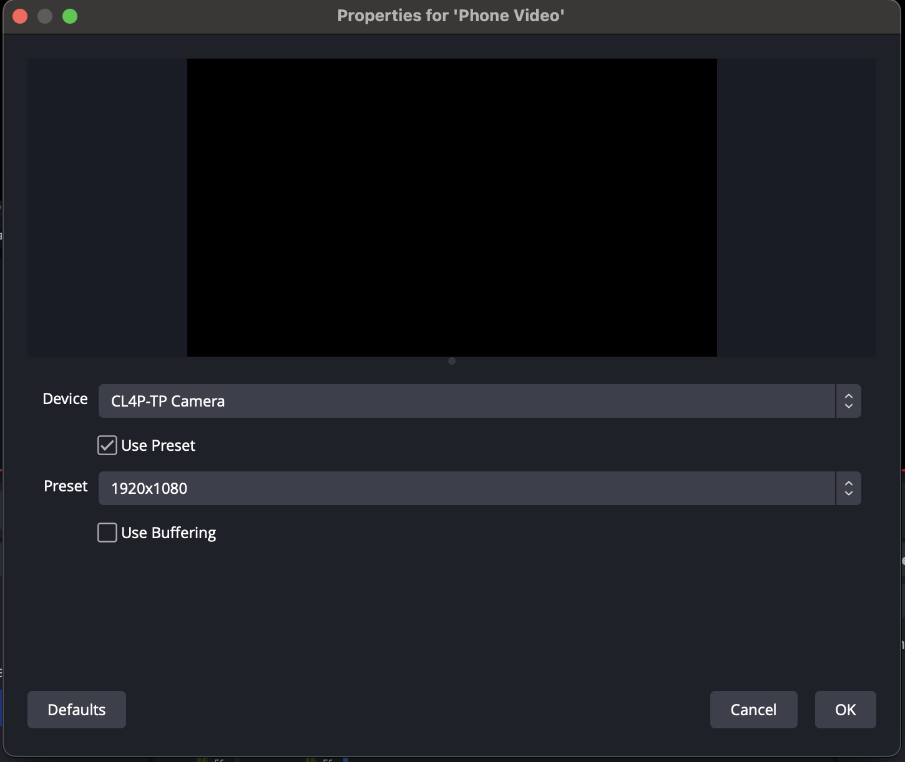

- Add a macOS Screen Capture Source for the browser window and place it where you want. I have to select my browser every time I open OBS because it defaults to some random control panel.
- (This is where you could add another video source such as a foot cam if you wanted)

<h3>Reaper Recording Setup</h3>

- Go into Reaper Preferences/Audio/Device settings and select the interface. To do this click on the 48kHz 24bit blahblahblah in the menu bar. It opens up the Preferences window.

- I’m recording from my Behringer so I choose USB Audio CODEC. Why are there two? I don’t know, it doesn’t matter which one I pick. Click OK.

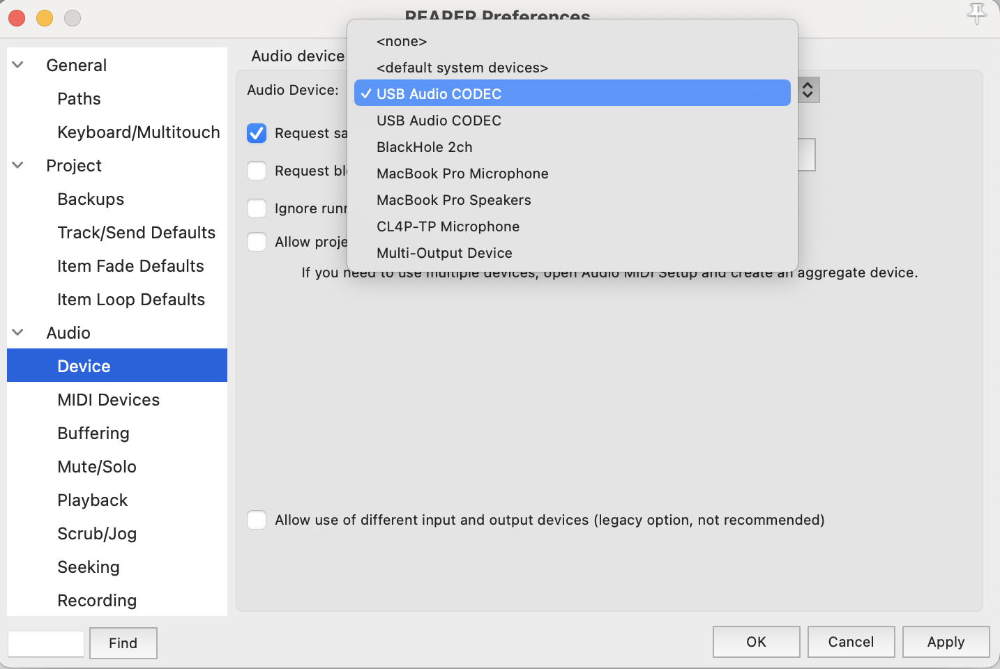

- Back in the main window, Insert a new track.
- Arm the track.
- Input/Input: Stereo/Input L/R

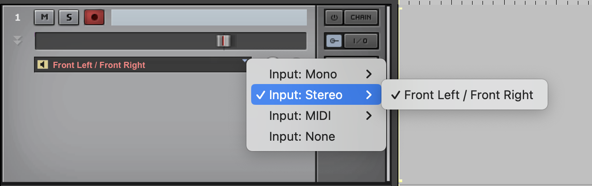

- Check your incoming audio levels. I run mine at around -10.

You are now ready to record.

<h3>Actually Recording, FINALLY</h3>

The following is what I do on a normal basis since everything is set up. The checklist takes maybe 3-5 minutes. Most of the time is spent on getting the camera shot decent.

Run through the setup checklist

1. Setup camera shot
2. Plug in USB interface
3. Control Center/Sound/Multi-Output
4. Check OBS Audio levels from browser (if none, check Audio Midi Setup and reselect USB Audio Codec)
5. Check OBS Browser source is on the right window
6. Select correct Audio Device in Reaper
7. Create Track
8. Arm Track
9. Switch track inputs to Stereo
10. Check incoming audio levels

Start OBS recording

Start Reaper recording

Do a stick click to help the sync

Play drums

Stop OBS and Reaper

<h3>
Reaper Audio Processing</h3>

After recording, go back into Audio Devices and select \<default system device\> and in the Mac task bar, Control Center/Sound/External Speakers.

Back in Reaper, normalize the drum audio: Shift-N.

If I have missed badly on the L/R level balance, I will right-click the item/Item processing/Explode multichannel audio…. and normalize them separately.

<h4>Audio FX</h4>

This is my audio FX stack.

- Stereo Alignment Delay[^7]
- ReEQ
- ReaVerb with Lexicon 480L Drum Plate impulse
- 1175 Compressor

I made a FX chain for one click use[^6].

<h3>Reaper Video Processing</h3>

Reaper does video! It’s a bit primitive but it does enough and it’s super easy to work with because you treat video just like audio. Drag the video file OBS created in as another track and edit it just like the audio.[^8]

In order to see the video you will need to go to View/Video.
It will open a window.
Right click in the window and select Dock.
It should appear down in the dock.
Now you can see your video.

Once you zoom in and align the tracks, select both the audio and video tracks and hit G to group them[^9]. Then cuts, dragging, and fades will affect both the video and audio and everything will stay nicely aligned.

<h4>Video FX</h4>

You need a Video Processor FX to set the fades to work on video so you can fade-in, fade-out and cross-fade between clips.

- Video Processor. Preset: Basic Helpers: Item fades affect video

<h4>DaVinci Resolve</h4>
For more complex video stuff, I use DaVinci Resolve, thanks to this brilliant tutorial by Kalle: [https://www.youtube.com/watch?v=iFkyfCgeozQ](https://www.youtube.com/watch?v=iFkyfCgeozQ)

Reaper is better for aligning audio and video because DaVinci snaps to the nearest frame, so you can be up to 15ms off. If I am going to use DaVinci, I align and render in Reaper and then import the rendered file into DaVinci.

Here’s a live re-enactment of me creating a video in Reaper. I started after dragging the video in because I forgot, basically. [https://www.youtube.com/watch?v=V5RhuFKkpMI](https://www.youtube.com/watch?v=V5RhuFKkpMI)

There you go. As promised, an overly detailed look at my recording setup. _It is_ a healthy chunk of setup and it took a few weeks before I was happy with my settings, and you can see in the video how every few weeks my FX have morphed enough to save them again, but once it’s set up, it really isn’t a burden to use on a regular basis.

[https://www.youtube.com/watch?v=g6_3x5tC6uI&t=4s](https://www.youtube.com/watch?v=g6_3x5tC6uI&t=4s)

<h2>Endnotes</h2>

A bunch of preliminary stuff that might be insultingly easy if you know it already but frustrating if you don’t.

<h3>Reaper Commands</h3>

- S splits items at the cursor.
- Spacebar starts/stops playback
- Scroll to zoom in/out
- The cursor is the line that moves as the audio plays.
- The playhead is the line that marks where playback starts from. Move the playhead by clicking in the timeline. You can also move it using the arrow keys.
- The cursor will jump back to the play head when you stop playback. This will cause you grief. Changing it to move the playhead to where the cursor stops is possible, but just causes different griefs.
- The playhead and cursor behave differently based on whether audio is playing and where you click. Experimenting is the best way to get a handle on it. I’m not just saying that because it’s all muscle memory now and I actually don’t know.
- Drag an item into another item to create a crossfade.
- Hover near the top corner of an item to get the fade handle.
- When you select multiple items, G groups them, U ungroups them. You still have to deselect the items after you ungroup them.
- You can adjust the shape of fades by right-clicking when your pointer is the fade icon.
- For volume automation, press V. Then SHIFT-Click on the line to create start/end points. Click and drag the points where you want or right-click on the point/Set point value if you know what you want and right-click/Set point shape if you want to change the fade shape.
- Panning works the same as volume, except it’s P. With a stereo track you have Right-click/Item Processing/Explode multichannel audio… and pan the tracks separately.

<h3>Installing Reaper Extensions and Plugins</h3>

1. This video on how to install the most important extensions (VLC, FFMPEG, SWS): [https://reaper.blog/2020/05/howto-extensions/](https://reaper.blog/2020/05/howto-extensions/)
2. How to install plugins (drop into folder): [https://www.youtube.com/watch?v=9EegrN-gF5o](https://www.youtube.com/watch?v=9EegrN-gF5o)
3. How to install plugins from a ReaPack repository: [https://www.youtube.com/watch?v=BJI52lUZxJU](https://www.youtube.com/watch?v=BJI52lUZxJU)

<h3>My FXs</h3>

<h5>Install ReEq</h5>

[https://forum.cockos.com/showthread.php?t=213501](https://forum.cockos.com/showthread.php?t=213501)

Scroll down to the bottom of the first post, get the ReJJ.zip file, and follow #2 above. (Drop the entire unzipped folder in.)

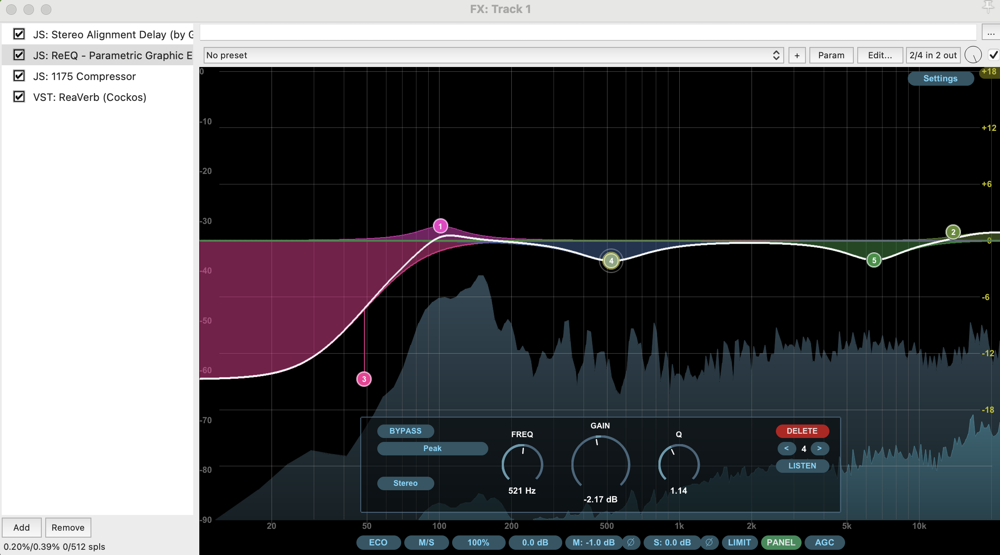

My points are at 50, 100, 520, 6.5k and 14k. 50 is rumble roll-off, 100 is where my kick sits, 520 is ugly snare mids, 6.5 is harsh cymbals and 14 is a little air for the cymbals. I’ll have a fish around occasionally if something sounds weird but this is almost always good enough. Of course you should adjust yours to taste.

<h5>The 1175 compressor is installed by default[^10]</h5>

Yay! Here’s a how-to guide anyway: [https://www.youtube.com/watch?v=eJM9qZbI0k4](https://www.youtube.com/watch?v=eJM9qZbI0k4)

I’ll vary the threshold based on recording levels, but it’s always somewhere between 3-8 (thanks Normalize!)

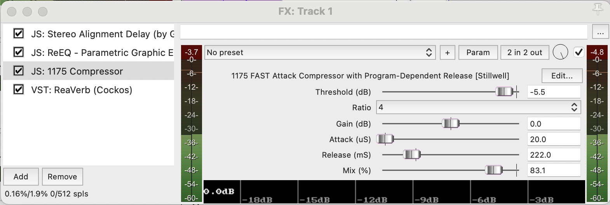

<h5>Install Impulse Responses for ReaVerb</h5>

Impulses are audio file captures of how a reverb sounds so they can be shared. The reverb I’m using is a Lexicon 480L Drum Plate, the bundle with the Impulses is available here: [https://grantnelson.co/article/1/lexicon-480l-free-impulse-responses](https://grantnelson.co/article/1/lexicon-480l-free-impulse-responses).

Unzip and save the files somewhere on your computer out of the way, but still readily available. When you add ReaVerb to the track FX, click Add, then File and browse to where you saved your Impulse. These are my basic settings, I mostly only change the Wet ratio somewhere between -41 and -38.

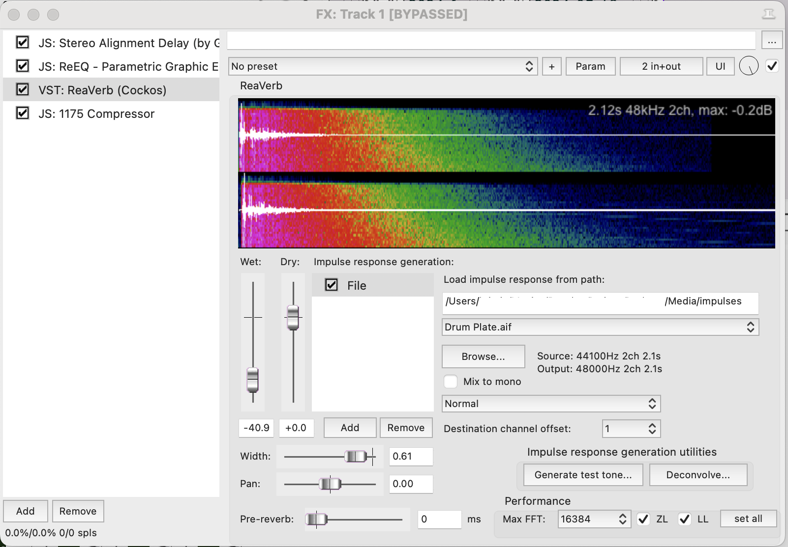

<h4>Create FX Chain</h4>

These effects are great and all but I’m not going to set that up every week. Once you get some settings you’re happy with, save them as a chain for easy, one-click recall.

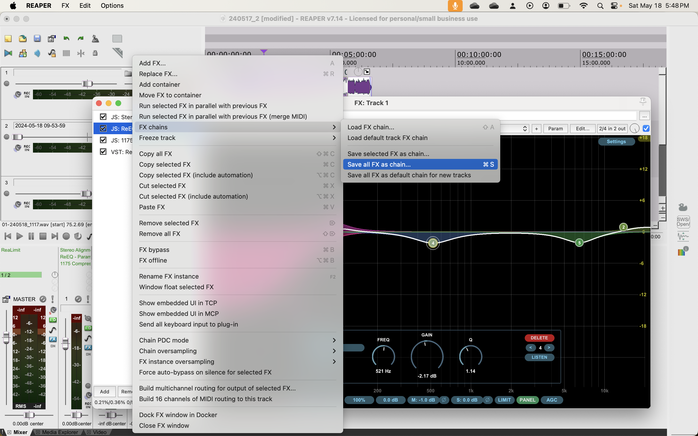

<h4>Video FX</h4>

All the video FX are presets of the Video Processor FX. Add it and then choose the Preset you want. This is the only one I use because the more complicated stuff is easier in DaVinci.

A video on some of its capabilities: [https://www.youtube.com/watch?v=SPULwlLjQOU](https://www.youtube.com/watch?v=SPULwlLjQOU)

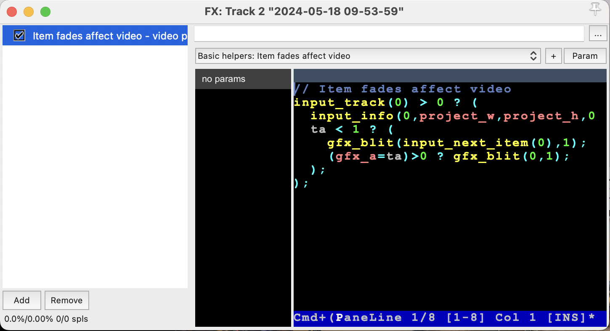

<h4>Master FX</h4>

Finally, I put a brickwall limiter on the Master mix. If the rest of the gain staging is done right it doesn’t do much, but it’s a nice safety feature. ReaLimit is built in and I set the Brickwall Ceiling to -0.3db. I save it as its own FX chain so I don’t have to set it every week.

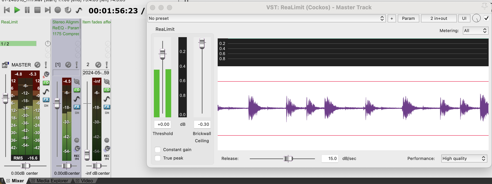

<h3>Render Settings</h3>

Tbh, I’m not sold on my video render settings, but these are, again, good enough for now. I’ve been considering upping the video bitrate to 8000kbps to see what that does besides taking longer to render.

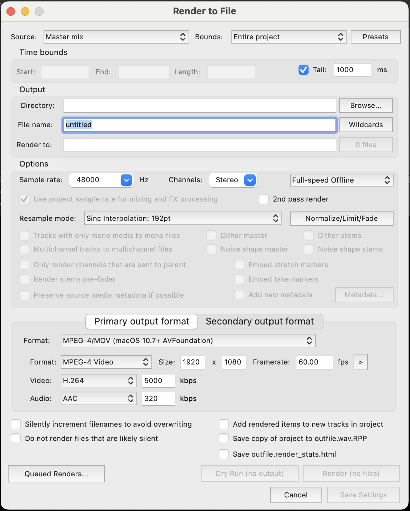

<!-- Footnotes -->

## Footnotes

[^1]: Surprisingly unhelpful video from the inventor of recorderman, but it has its charms: [https://www.youtube.com/watch?v=pR3oYOAGhQE](https://www.youtube.com/watch?v=pR3oYOAGhQE) I think he over-exaggerates the need for more mics. Does it sound better, yes. Is it decent with 2, also yes.

[^2]: The other half is blue lasers.

[^3]: Actually, it’s dual mono. I could just plug one channel in but that’s not important right now.

[^4]: https://www.alphr.com/obs-how-to-record-separate-audio-tracks/

[^5]: This sent me down a rabbit hole and I found a Reaper script that might make it easy to record everything in OBS and explode the audio tracks out in Reaper. [https://www.youtube.com/watch?v=diSDgw1g7QE](https://www.youtube.com/watch?v=diSDgw1g7QE) If it works, this changes everything. And by everything I mean it eliminates starting two recordings and the alignment step. So this document might already be outdated.

[^6]: FX install and settings info is in the end notes.

[^7]: Not really necessary if your mics are nearly in phase.

[^8]: Video setup tutorial: [https://www.youtube.com/watch?v=KsH5Neg4KlY](https://www.youtube.com/watch?v=KsH5Neg4KlY) I don’t bother with glueing and splitting, etc. But it walks through the initial setup.

[^9]: Reaper does weird things if you cut a group where the beginning of the items aren't aligned. It wants to preserve the original start positions.

[^10]: Fun drama about it (the issue was fixed in 6.26): [https://www.youtube.com/watch?v=eEQ7K2KVXF4](https://www.youtube.com/watch?v=eEQ7K2KVXF4)
